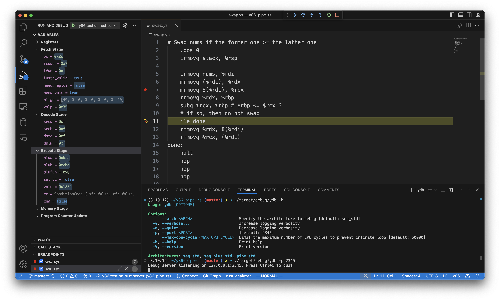

# y86-debugger: A debugger extension for Y86 assembly language

This debugger extension is specifically designed for [y86-pipe-rs](https://github.com/sshwy/y86-pipe-rs)

## Features

Describe specific features of your extension including screenshots of your extension in action. Image paths are relative to this README file.

For example if there is an image subfolder under your extension project workspace:

\!\[feature X\]\(images/feature-x.png\)

> Tip: Many popular extensions utilize animations. This is an excellent way to show off your extension! We recommend short, focused animations that are easy to follow.

## Getting Started

After install this extension, create a new file `.vscode/launch.json` in your workspace with the following content:

```json
{
    "version": "0.2.0",
    "configurations": [
        {
			"type": "y86",
			"request": "launch",
			"name": "y86 test on rust server",
			"program": "${workspaceFolder}/${fileBasename}",
			"debugServer": 2345
		}
    ]
}
```

Before debugging, you need to build the debug server by running `cargo build`. You can execute `./target/debug/ydb` for help.

Then open the y86 file you want to debug and set some breakpoints.

Basically you can execute `./target/debug/ydb -p 2345` to start the debug server. You may set different architectures by `--arch` option.

Finally, goto "Run and Debug" tab, select "y86 test on rust server" and click the play button to start debugging. The debugger should stop at the entry of your program.

